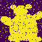
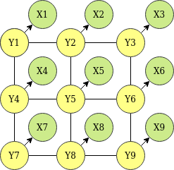
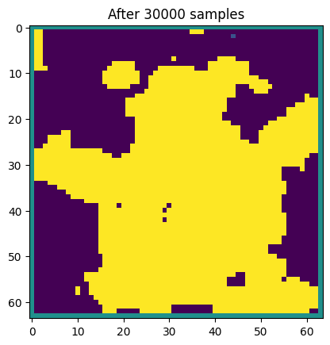
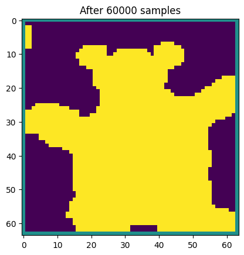
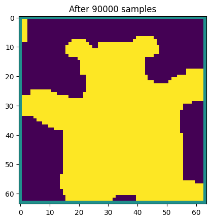
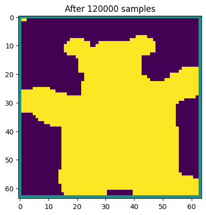

# Bayesian-Image-Denoising
Bayesian approach to image denoising - The goal is to denoise a corrupted image using Bayesian inference with a very simple prior. The code works with noisy_bear.png, which is a corrupted version of original_bear.png. Both these images are shown below.

| Original | Noisy |
| --- | --- |
|  |  |

## The probabilistic model
Let $X$ denote the degraded image (of size $M \times N$) and $Y$ the original image to be reconstructed. The following figure depicts a simple probabilistic model of the joint distribution of $(X,Y)$:

Let $p = (i,j)$ denote a position in the image and let $X_p = X(i,j), Y_p = Y(i,j)$ be the values of $X$ and $Y$ at that location. Recall that these values are -1 or +1. Write $p \sim q$ if $p,q$ are neighboring pixels; note that pixel $p = (i,j)$ has neighbors ${\mathcal{N}}(p) = \{ (i-1,j), (i+1,j), (i,j-1), (i,j+1)\}$. Then the probability of $X,Y$ is:

$$Pr(X,Y) \propto \prod\limits_{p \in [M] \times [N]} \phi(X_{p},Y_{p})\prod\limits_{p \sim q}\phi(Y_p, Y_q) $$

All clique potentials are identical functions with $\phi(u, v) = e^{uv}$.

## Sampling from the posterior
Gibbs sampling is used to sample from the <b>posterior distribution over $Y$ given $X$</b> :

* Initialize the recovered image with each pixel set uniformly to $\{-1,+1\}$
* Repeatedly choose a pixel $p$ to update and re-sample its value from $Pr(Y_p | X, Y_{\setminus p})$.

In the final reconstructed image, each pixel p is set to the sign of the posterior marginal $E[Y_p | X]$.

## Reconstruction

